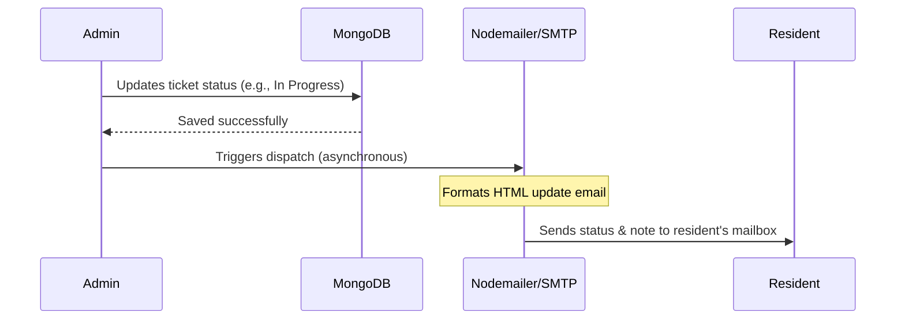

# System Design: Society Maintenance Tracker

This document explains the core architectural patterns, design decisions, and data flows implemented in the **Society Maintenance Tracker** application.

---

## 1. Complaint History Model & Audit Trail

To build a transparent maintenance pipeline, we decoupled the **Complaint** from its state transitions using an audit-log pattern with the `ComplaintHistory` model.

### Data Schemas & Relationships
* **Complaint**: Stores the current state (`currentStatus`), priority (`priority`), photo attachment link (`photoUrl`), resident who raised it (`residentId`), and creation metadata.
* **ComplaintHistory**: A transactional record mapping to a single complaint. It stores:
  * `complaintId` (reference to parent complaint)
  * `status` (state of transition: `Open`, `In Progress`, or `Resolved`)
  * `actorId` (the user/admin who triggered the transition)
  * `note` (optional explanatory comment)
  * `timestamp` (the exact time of modification)

### Design Advantages
1. **Immutable History**: Rather than overwriting the single status field, each lifecycle change creates a new log. This establishes an unalterable audit trail.
2. **Accountability**: Saving the `actorId` enables residents to see exactly who worked on their issue (e.g. which admin reassigned it or marked it resolved).
3. **Timeline Visualization**: On the frontend, sorting the history logs by `timestamp` chronologically yields an interactive vertical progress timeline.

---

## 2. Overdue Detection Logic

The application flags tickets that exceed standard resolution timeframes using an environment-controlled day threshold (`OVERDUE_THRESHOLD_DAYS`, default: 3).

### Sync-on-Query Execution
Instead of resource-heavy background cron-jobs, we implement a **lazy, sync-on-query approach**:
1. When an admin requests stats or filters the complaints board, the backend parses `OVERDUE_THRESHOLD_DAYS` and calculates a cutoff date:
   $$\text{Cutoff} = \text{Date.now()} - (\text{Threshold} \times 24 \times 60 \times 60 \times 1000)$$
2. The database updates all open tickets older than this cutoff:
   ```javascript
   await Complaint.updateMany(
     { currentStatus: { $ne: 'Resolved' }, createdAt: { $lt: cutoffDate }, isOverdue: false },
     { isOverdue: true }
   );
   ```
3. Resolved tickets are automatically cleaned of the overdue flag (`isOverdue: false`).
4. In the database query, we sort results by `{ isOverdue: -1, createdAt: -1 }`. This automatically pins overdue complaints at the top, followed by the newest complaints, forcing admins to address lingering tickets first.

---

## 3. Photo Upload Handling (Multer)

Residents can upload images representing maintenance concerns. We utilize the **Multer** middleware on the `/api/complaints` route.

### Storage & Filtering
* **Local Disk Storage**: Uploaded files are written directly to `backend/uploads/` on the server disk. Filenames are customized to prevent collisions by appending a high-resolution randomized suffix: `${Date.now()}-${randomSuffix}.extension`.
* **Security Validation**: A file filter blocks non-image formats, restricting uploads to `image/jpeg`, `image/png`, and `image/webp`. A 5MB limit prevents storage exhaustion.
* **Static Access**: The Express app mounts the folder statically (`app.use('/uploads', express.static(...))`). The database stores relative links (`/uploads/filename.jpg`) which are resolved seamlessly by the client.

*Production note: Local disk storage is ephemeral on Vercel/Render. In production, Multer's memory storage is substituted with a Cloudinary or AWS S3 storage engine, returning a permanent CDN url.*

---

## 4. Email Notification Flow

Email notification is built using **Nodemailer** and SMTP credentials (e.g. Mailtrap) configured through environmental configurations.



### Key Broadcast Events
1. **Status Update**: Changing a complaint status fetches the owner resident's email and dispatches an HTML email detailing the new state and the admin's notes.
2. **Urgent Notice Broadcast**: When an Admin checks `isImportant` on a Notice board update, the controller queries all residents (`User.find({ role: 'Resident' })`) and fires an email notification asynchronously to their mailboxes.
3. **Graceful Fallback**: If SMTP parameters are omitted in development, the service falls back to console logger outputs, ensuring no crash interrupts local testing.
